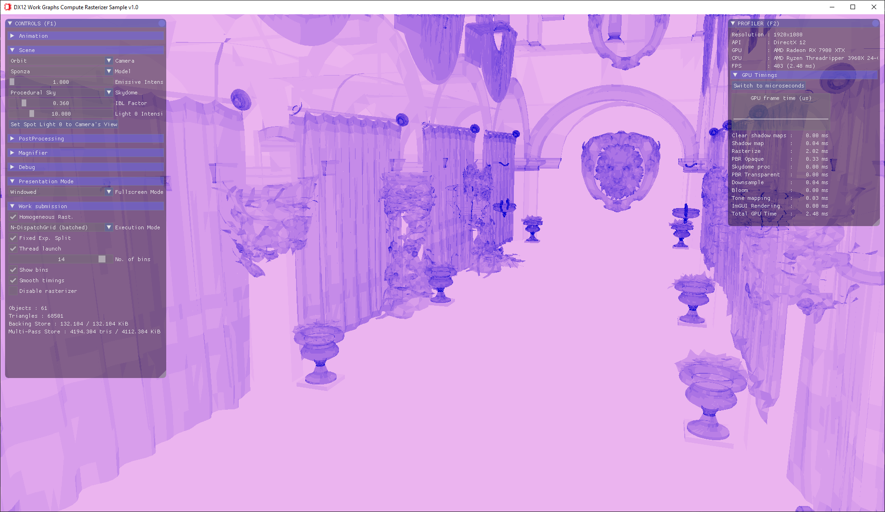

# Work Graphs Compute Rasterizer Sample

A compute rasterizer sample implemented with Work Graphs running inside the [Cauldron framework](https://github.com/GPUOpen-LibrariesAndSDKs/Cauldron).



# Build Instructions

### Prerequisites

To build the Work Graphs Compute Rasterizer Sample, you must first install the following tools:

- [CMake 3.16](https://cmake.org/download/)
- [Visual Studio 2022](https://visualstudio.microsoft.com/downloads/)
- [Windows 10 SDK 10.0.18362.0](https://developer.microsoft.com/en-us/windows/downloads/windows-10-sdk)

Then follow the next steps:

1) Clone the repo with its submodules:
    ```
    > git clone https://github.com/GPUOpen-LibrariesAndSDKs/WorkGraphComputeRasterizer --recurse-submodules
    ```

2) Generate the solutions:
    ```
    > cd WorkGraphComputeRasterizer\build
    > GenerateSolutions.bat
    ```

3) Open the solution in the DX12 directory, compile and run. VK isn't supported.

4) The define `ENABLE_EXPERIMENTAL_WORKGRAPHS` enables Work graphs. It's enabled by
   default. It can be disabled if [PIX](https://devblogs.microsoft.com/pix/introduction/),
   [RenderDoc](https://renderdoc.org) or another tool without Work graphs
   support is used to debug. Use CMake to disable the feature:
    ```
    > cmake -DGFX_API_WG=OFF
    ```

5) The media samples from Cauldron may change and not all scenes may load,
   you can adjust scenes in [src\Common\GLTFSample.json](src\Common\GLTFSample.json)

6) You can request precise profiling data through commandline by passing json as arguments:
    ```
    > cd WorkGraphComputeRasterizer\bin
    > GLTFSample_DX12.exe { "algorithm" : 4, "bins" : 13, "threadlaunch" : true, ^
        "stablePowerState" : true, "profile" : true, "ProfileSettings": { "filter" : ^
        "Rasterize", "exitWhenTimeEnds": true, "resultsFilename": "Sponza.csv", ^
        "warmUpFrames": 50, "durationFrames": 20 } }
    ```

   algorithm:\
    0 - monolithic compute rasterizer, called once per object\
    1 - monolithic compute rasterizer, all objects are consumed by one ExecuteIndirect\
    2 - multi-pass compute rasterizer, all objects are consumed by a pipeline of three ExecuteIndirect\
    3 - workgraph rasterizer, called once per object\
    4 - workgraph rasterizer, called once in total with all object batched\
    5 - workgraph rasterizer, all objects are consumed by an initial Broadcaster node

   bins:\
    1 to 15: number of buckets/bins to group triangles by, 2^(bin-1) = area

   threadlaunch:\
    false/true: use a thread-launch or coalesce node for triangle rasterization

   profile:\
    false/true: enables automatic profiling and generation of a csv file

   filter:\
    label: the label of the pass to collect timestamps for, if empty all passes are included in the csv

   resultsFilename:\
    filename: the name of the csv in the current directory

   warmUpFrames:\
    0 to inf: how many frames to wait for initialization to settle

   durationFrames:\
    0 to inf: how many frames to include in the csv

   The values in the resulting csv are raw gpu ticks without any conversion.
   
7) The algorithm and some results are presented in this GPUOpen blog entry:

   https://gpuopen.com/learn/work_graphs_learning_sample/
